# PAF Framework

> **P**erspective **A**gent **F**ramework - Enterprise-Grade Multi-Agent Development System

[](https://opensource.org/licenses/MIT)
[](https://claude.ai)
[](https://github.com/crack00r/paf-framework)
[](https://github.com/crack00r/paf-framework/releases)
[](https://github.com/crack00r/paf-framework#installation)
[](https://github.com/crack00r/paf-framework#github-integration)

PAF is a comprehensive multi-agent orchestration framework that implements a complete Software Development Life Cycle (SDLC) with 38 specialized AI agents. Using hierarchical team structures and the nested-subagent plugin, PAF enables enterprise-grade code reviews, feature development, and project management.

## ✨ Key Features

- **38 Specialized Agents** - Full SDLC coverage across 8 categories
- **Hierarchical Teams** - Team leads coordinate specialized sub-agents
- **10 Perspective Reviewers** - Cross-cutting analysis (Security, Performance, UX, etc.)
- **3 Build Presets** - Quick (2-3 min), Standard (8-12 min), Comprehensive (20-30 min)
- **Semantic Understanding** - Claude understands your intent from natural language
- **Nested Agent Spawning** - Unlimited depth for complex workflows
- **🐙 GitHub Integration** - Automatic issue creation, project boards, and lifecycle management

## 🏗️ Architecture Overview


### Workflow Flow


### Perspective Review

```mermaid
graph LR
    subgraph "10 Perspectives"
        A[🔒 Alex<br/>Security]
        E[⚡ Emma<br/>Performance]
        S[🎨 Sam<br/>UX]
        DV[🔀 David<br/>Scalability]
        M[🔧 Max<br/>Maintainability]
        L[♿ Luna<br/>Accessibility]
        T[💰 Tom<br/>Cost]
        N[🎯 Nina<br/>Triage]
        LE[📚 Leo<br/>Documentation]
        AV[💡 Ava<br/>Innovation]
    end
    
    A --> G[📋 George<br/>Aggregator]
    E --> G
    S --> G
    DV --> G
    M --> G
    L --> G
    T --> G
    N --> G
    LE --> G
    AV --> G
    
    G --> R[Final Report]
```



## 🚀 Quick Start

### Prerequisites

- [Claude Code](https://docs.anthropic.com/en/docs/claude-code) CLI
- Node.js v18+ (for the integrated plugin)

### Installation

#### One-Click Install (Recommended)

```bash
curl -sSL https://raw.githubusercontent.com/crack00r/paf-framework/main/install.sh | bash
```

#### Manual Install

```bash
# Clone
git clone https://github.com/crack00r/paf-framework.git ~/.paf

# Verify
bash ~/.paf/scripts/verify-paf.sh
```

#### Docker

```bash
docker build -t paf-framework .
docker run -it paf-framework
```

### Updating PAF

When a new version is available:

```bash
# Navigate to your PAF repository clone
cd /path/to/paf-framework

# Pull latest changes
git pull

# Run update script (syncs to ~/.paf/, preserves your configs)
./update.sh
```

The update script will:
1. Backup your user configurations (preferences.yaml, etc.)
2. Sync new framework files to ~/.paf/
3. Restore your configurations
4. Rebuild the plugin if needed
5. Run verification

**Project-level updates:** When you run `/paf-cto` in a project, the CTO automatically checks if your project's PAF version is outdated and offers to update it.

### New Project Setup

```bash
# Create new project folder
mkdir my-project && cd my-project

# Start Claude Code
claude

# Initialize PAF (sets up Git, GitHub, and PAF structure)
/paf-init
```

The `/paf-init` command will:
1. Ask if you want to create a Git repository
2. Optionally create a GitHub repository
3. Set up PAF structure (COMMS.md, .paf/)
4. Optionally configure GitHub labels, boards, and templates via Gideon

### Basic Usage

```bash
# Simple review
/paf-cto "Review my authentication implementation"

# Quick check (2-3 minutes, 5-8 agents)
/paf-cto "Quick security check" --build=quick

# Standard review (8-12 minutes, 15-20 agents)
/paf-cto "Review this feature"

# Full audit (20-30 minutes, all 38 agents)
/paf-cto "Complete audit before release" --build=comprehensive
```

## 👥 The 38 Agents

### By Category

| Category | Count | Agents |
|----------|-------|--------|
| **Orchestration** | 1 | CTO |
| **Discovery** | 3 | Ben (Data), Maya (Product), Iris (Innovation Scout) |
| **Planning** | 3 | Sophia (Architect), Michael (Tech Lead), Kai (PM) |
| **Implementation** | 5 | Anna, Chris, Dan, Sarah, Tina |
| **Review** | 4 | Rachel (Lead), Stan, Scanner, Perf |
| **Deployment** | 3 | Tony (DevOps), Rel (Release), Miggy (Migration) |
| **Operations** | 3 | Inci (Incidents), Monitor, Feedback |
| **Perspectives** | 10 | Alex 🔒, Emma ⚡, Sam 🎨, David 🔀, Max 🔧, Luna ♿, Tom 💰, Nina 🎯, Leo 📚, Ava 💡 |
| **Retrospective** | 3 | George (Aggregator), Otto (Optimizer), Docu |
| **Utility** | 3 | Gideon 🛠️ (GitHub Setup), Bug-Fixer 🐛, Validator ✅ |

### The 10 Perspectives

| Agent | Focus | Catches |
|-------|-------|---------|
| Alex 🔒 | Security | Vulnerabilities, auth issues, OWASP |
| Emma ⚡ | Performance | N+1 queries, bottlenecks, caching |
| Sam 🎨 | UX | Usability, flows, states |
| David 🔀 | Scalability | Architecture, load handling |
| Max 🔧 | Maintainability | Code smells, tech debt |
| Luna ♿ | Accessibility | WCAG, screen readers |
| Tom 💰 | Cost | Cloud costs, optimization |
| Nina 🎯 | Triage | Prioritization, go/no-go |
| Leo 📚 | Documentation | Docs quality, coverage |
| Ava 💡 | Innovation | Better alternatives |

## ⚡ Build Presets

| Build | Time | Agents | Teams |
|-------|------|--------|-------|
| `quick` | 2-3 min | 5-8 | Perspectives + Triage |
| `standard` | 8-12 min | 15-20 | + Review + Retrospective |
| `comprehensive` | 20-30 min | 30-38 | All SDLC phases |

## 📊 Workflows

| Workflow | Description |
|----------|-------------|
| `perspective-review` | Multi-perspective code review |
| `security-audit` | Deep security analysis |
| `performance-review` | Performance optimization |
| `full-feature` | Complete feature development |
| `bugfix` | Bug investigation & fix |
| `hotfix` | Emergency production fix |
| `retrospective` | Sprint retrospective |

## 🔧 Commands

```bash
/paf-cto          # Main orchestrator
/paf-fix          # Auto-fix build errors
/paf-validate     # Build verification
/paf-status       # Project status
/paf-help         # Help system
/paf-quickref     # Quick reference
/paf-setup-github # Manual GitHub setup
```

## 🐙 GitHub Integration

PAF includes full GitHub integration for persistent issue tracking and project management.

### Automatic Setup

When you first run `/paf-cto`, the system automatically:
1. Detects missing GitHub configuration
2. Spawns **Gideon** (Setup Agent) once
3. Creates 91 Labels, 7 project boards, 8 issue templates
4. Generates `.paf/GITHUB_SYSTEM.md` with all IDs
5. Never runs setup again for this repository

### What Agents Do

Every agent that finds issues:
- Creates a GitHub Issue with proper labels (e.g., `[SEC-001] SQL Injection`)
- Adds it to the appropriate project board
- Sets priority (P0-P3) and category labels

### Project Boards

| Board | Purpose |
|-------|---------|
| 📋 PAF Sprint Board | Main development workflow |
| 🔒 PAF Security Board | Security findings (Alex, Scanner) |
| 📊 PAF Product Backlog | Features & ideas (Maya, Ava) |
| 🏗️ PAF Architecture | ADRs (Sophia, David) |
| 🐛 PAF Bug Tracker | Bugs & incidents (Tina, Inci) |
| 🔧 PAF Tech Debt | Code quality (Max, Stan) |
| 🚀 PAF Release Pipeline | Deployments (Tony, Rel) |

### Issue Prefixes

| Agent | Prefix | Category |
|-------|--------|----------|
| Alex 🔒 | SEC | Security |
| Emma ⚡ | PERF | Performance |
| Sam 🎨 | UX | User Experience |
| Max 🔧 | MAINT | Maintainability |
| Luna ♿ | A11Y | Accessibility |

See [GitHub Workflow](docs/GITHUB_WORKFLOW.md) for complete documentation.

## 📁 Structure

```
~/.paf/
├── agents/           # 38 agent definitions
│   ├── orchestration/
│   ├── discovery/
│   ├── planning/
│   ├── implementation/
│   ├── review/
│   ├── deployment/
│   ├── operations/
│   ├── perspectives/
│   ├── retrospective/
│   └── utility/
├── config/           # Configuration
├── workflows/        # Workflow definitions
├── commands/         # Command definitions
└── scripts/          # Utility scripts
```

## 📚 Documentation

- [Installation Guide](docs/INSTALLATION.md)
- [Quick Start](docs/QUICK_START.md)
- [Plugin Setup](docs/PLUGIN_SETUP.md)
- [Configuration](docs/CONFIGURATION.md)
- [Examples](examples/) - Quick, Security & Performance Review Examples
- [FAQ](FAQ.md)
- [Troubleshooting](docs/TROUBLESHOOTING.md)

## 🔌 Integrated Plugin

PAF includes an integrated MCP plugin for hierarchical agent nesting. The plugin is automatically built with `./install.sh`.

The plugin is automatically registered with Claude Code. If you encounter issues, see [Plugin Setup](docs/PLUGIN_SETUP.md).

## 🤝 Contributing

See [CONTRIBUTING.md](CONTRIBUTING.md) for guidelines.

## 📄 License

MIT License - see [LICENSE](LICENSE)

---

**Made with ❤️ for enterprise-grade AI development**
